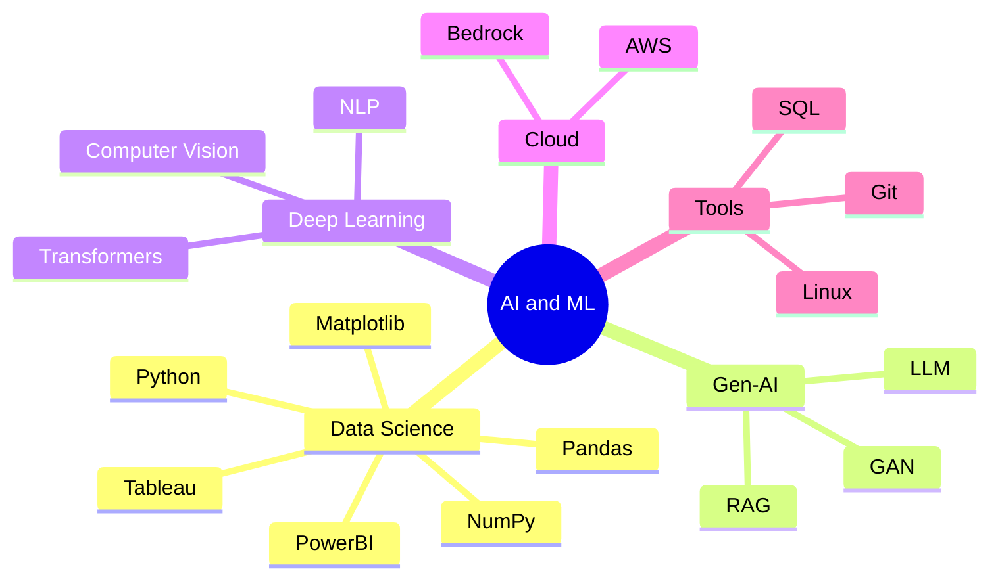

<div align="center">
  
```ascii
                                            ╔═══════════════════════════════════════╗
                                            ║    Machine Learning & Data Science    ║
                                            ║        Generative AI Enthusiast       ║
                                            ║         Crafting AI Solutions         ║
                                            ╚═══════════════════════════════════════╝
```
<br>

  [](https://git.io/typing-svg) 


</div>

<h1 align="center">Hi 👋, I'm Pratyush Puri</h1>
<h3 align="center">A passionate, hardworking, Generative AI Engineer from India</h3>

<div align="center">
  
### `print("Hello World! 👋")`
```python
                      class DataEngineerEmthusiast:
                        def __init__(self):
                          self.name = "Pratyush Puri"
                          self.role = "Gen-AI & Data Science Practitioner"
                          self.language_spoken = ["Hindi", "English"]
                          self.interests = ["AI", "ML", "Computer Vision", "NLP","Gen-AI","LLM"]
                                                                      
                        def say_hi(self):
                          print("Thanks for visiting my GitHub! Let's build something amazing together!")
                      
                      me = DataEngineerEnthusiast()
                      me.say_hi()
```
</div>

## 🤖 AI & ML Arsenal



<!---->

## 🎓 Learning Journey

<div align="center">

| Certification | Issuer | Focus Area |
|--------------|---------|------------|
| AWS Cloud Practitioner | AWS | Cloud Computing |
| AI Applications | Amazon Bedrock | Gen AI |
| LLM Specialist | NASBA | Gen AI & NLP |
| Data Engineering | LinkedIn | Data Science |

</div>


<!--- 🌱 I’m currently learning **LLM, Generative AI, Computer Vision**

- 👨‍💻 All of my projects are available at [https://www.linkedin.com/in/pratyush-puri/](https://www.linkedin.com/in/pratyush-puri/)

- 💬 Ask me about **Unreal Engine 5, Android, Machine Learning, Power BI, SQL**

- 📫 How to reach me **pratyushpuri17@gmail.com**-->


## 💼 Experience Path
```
            ┌────────────────────┐
            │ Android Dev        │
            │ CodeClause         │
            └────────────────────┘
                    ↓
            ┌────────────────────┐
            │ ML Intern          │
            │ IIIT Allahabad     │
            └────────────────────┘
                    ↓
            ┌────────────────────┐
            │ Data Science       │
            │ Oasis Infobyte     │
            └────────────────────┘

```
## 🛠 Tech Stack Evolution

<div align="center">

```python
tech_stack = {
    "Languages": ["Python", "C++", "SQL"],
    "AI/ML": ["TensorFlow", "PyTorch", "Scikit-learn"],
    "Data": ["NumPy", "Pandas", "Matplotlib","Seaborn"],
    "GenAI": ["LangChain", "Hugging Face", "Transformers"],
    "Tools": ["Git", "Linux", "AWS","Tableau","PowerBI","Microsoft Excel","Microsoft Access"]
}
```

</div>

## 📈 Growth Metrics

<div align="center">
  
</div> <br>
<div align="center">
  <center></center></center>
</div>
<br>

<div align="center">

```ascii
╔═══════════════════════════════════════════╗
║  "The best way to predict the future is   ║
║           to create it." - AI Era         ║
╚═══════════════════════════════════════════╝
```

[](YOUR_LINKEDIN)
[](YOUR_GITHUB)

</div>

---
<div align="center">
  
### 🎯 Currently Reading Latest Research On:
- Large Language Models
- Computer Vision Applications
- Neural Network Architectures

</div>


