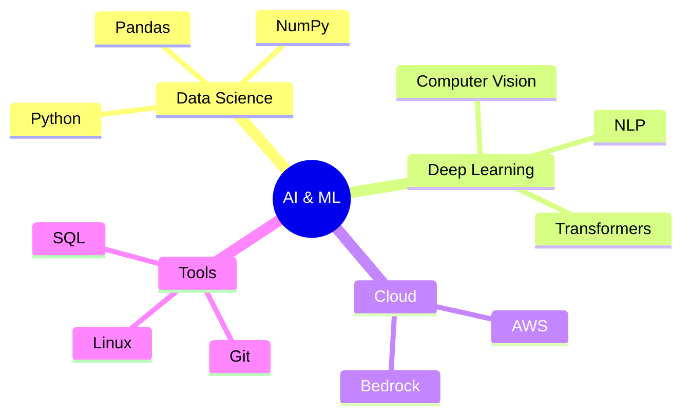

<div align="center">
  
```ascii
  ╔═══════════════════════════════════════╗
  ║    Machine Learning & Data Science     ║
  ║         Crafting AI Solutions         ║
  ╚═══════════════════════════════════════╝
```

[](https://git.io/typing-svg)

</div>

<div align="center">
  
### `print("Hello World! 👋")`
```python
class DataScientist:
    def __init__(self):
        self.name = "YOUR_NAME"
        self.role = "ML & Data Science Practitioner"
        self.language_spoken = ["Hindi", "English"]
        self.interests = ["AI", "ML", "Computer Vision", "NLP"]
    
    def say_hi(self):
        print("Thanks for visiting my GitHub! Let's build something amazing together!")

me = DataScientist()
me.say_hi()
```
</div>

## 🤖 AI & ML Arsenal



## 🚀 Project Highlights

<details>
<summary>🔍 SQL Query Conversion System</summary>

```sql
-- Converting complex SQL queries intelligently
SELECT project, impact, technology
FROM portfolio
WHERE project = 'SQL Converter'
```
- Automated SQL query transformation
- Enhanced query processing efficiency
- Smart syntax handling
</details>

<details>
<summary>🏥 COVID-19 X-ray Analysis</summary>

```python
# Deep Learning for Medical Imaging
class CovidDetector(nn.Module):
    """Using AI for healthcare"""
    pass  # Advanced CV implementation
```
- Deep learning for medical diagnosis
- Image processing pipeline
- High accuracy detection system
</details>

## 🎓 Learning Journey

<div align="center">

| Certification | Issuer | Focus Area |
|--------------|---------|------------|
| AWS Cloud Practitioner | AWS | Cloud Computing |
| AI Applications | Amazon Bedrock | Gen AI |
| LLM Specialist | NASBA | Gen AI & NLP |
| Data Engineering | LinkedIn | Data Science |

</div>

## 💼 Experience Path
```
┌────────────────────┐
│ ML Intern         │
│ IIIT Allahabad    │
└────────────────────┘
        ↓
┌────────────────────┐
│ Data Science      │
│ Oasis Infobyte    │
└────────────────────┘
        ↓
┌────────────────────┐
│ Android Dev       │
│ CodeClause        │
└────────────────────┘
```

## 🛠 Tech Stack Evolution

<div align="center">

```python
tech_stack = {
    "Languages": ["Python", "C++", "SQL"],
    "AI/ML": ["TensorFlow", "PyTorch", "Scikit-learn"],
    "Data": ["NumPy", "Pandas", "Matplotlib"],
    "GenAI": ["LangChain", "Hugging Face", "Transformers"],
    "Tools": ["Git", "Linux", "AWS"]
}
```

</div>

## 📈 Growth Metrics

<div align="center">
  
</div>

<br>

<div align="center">

```ascii
╔═══════════════════════════════════════════╗
║  "The best way to predict the future is   ║
║           to create it." - AI Era         ║
╚═══════════════════════════════════════════╝
```

[](YOUR_LINKEDIN)
[](YOUR_GITHUB)

</div>

---
<div align="center">
  
### 🎯 Currently Reading Latest Research On:
- Large Language Models
- Computer Vision Applications
- Neural Network Architectures

</div>
