<!--
<div align="center">

</div>-->

<br>


---

<br>


<div align="center">
  
```ascii
  ╔═══════════════════════════════════════╗
  ║    Machine Learning & Data Science    ║
  ║        Generative AI Enthusiast       ║
  ║         Crafting AI Solutions         ║
  ╚═══════════════════════════════════════╝
```
<br>

  [](https://git.io/typing-svg) 


</div>

<h1 align="center">Hi 👋, I'm Pratyush Puri</h1>
<h3 align="center">A passionate, hardworking, Generative AI Engineer from India</h3>

<div align="center">
  
### `print("Hello World! 👋")`
<br><br>

[](https://www.pratyushpuri.space)
<br><br>

```python
class DataEngineerEmthusiast:
  def __init__(self):
    self.name = "Pratyush Puri"
    self.role = "Gen-AI & Data Science Practitioner"
    self.language_spoken = ["Hindi", "English"]
    self.interests = ["AI", "ML", "Computer Vision", "NLP","Gen-AI","LLM"]
                                                                      
  def say_hi(self):
    print("Thanks for visiting my GitHub! Let's build something amazing together!")
                      
me = DataEngineerEnthusiast()
me.say_hi()
```
</div>
<br>

---

<br>


## 🤖 AI & ML Arsenal


<br>

<br>

<br>

---

<br>


## 🎓 Learning Journey


| Certification | Issuer | Focus Area |
|--------------|---------|------------|
| AWS Cloud Practitioner | AWS | Cloud Computing |
| AI Applications | Amazon Bedrock | Gen AI |
| LLM Specialist | NASBA | Gen AI & NLP |
| Data Engineering | LinkedIn | Data Science |

</div>

<br>

---

<br>

## 🏆 Trophies

<div align="center">
  
[](https://github.com/PratyushPuri)
</div>
<br>
<br>

---

<br>


<!--- 🌱 I’m currently learning **LLM, Generative AI, Computer Vision**

- 👨‍💻 All of my projects are available at [https://www.linkedin.com/in/pratyush-puri/](https://www.linkedin.com/in/pratyush-puri/)

- 💬 Ask me about **Unreal Engine 5, Android, Machine Learning, Power BI, SQL**

- 📫 How to reach me **pratyushpuri17@gmail.com**-->


## 💼 Experience Path
```
                                                    ┌────────────────────┐
                                                    │ Android Dev        │
                                                    │ CodeClause         │
                                                    └────────────────────┘
                                                            ↓
                                                    ┌────────────────────┐
                                                    │ ML Intern          │
                                                    │ IIIT Allahabad     │
                                                    └────────────────────┘
                                                            ↓
                                                    ┌────────────────────┐
                                                    │ Data Science       │
                                                    │ Oasis Infobyte     │
                                                    └────────────────────┘

```
<br>

---

<br>


## 🛠 Tech Stack Evolution

<div align="center">

```python
tech_stack = {
  "Languages": ["Python", "C++", "SQL"],
  "AI/ML": ["TensorFlow", "PyTorch", "Scikit-learn"],
  "Data": ["NumPy", "Pandas", "Matplotlib","Seaborn"],
  "GenAI": ["Ollama", "Hugging Face", "Transformers","Agemtic AI"],
  "Tools": ["Git", "Linux", "AWS","Tableau","PowerBI","Microsoft Excel"]
}
```

</div>

<br>

---

<br>

## My Contributions
<div align="center">
<picture>
  <source media="(prefers-color-scheme: dark)" srcset="https://raw.githubusercontent.com/PratyushPuri/PratyushPuri/output/github-snake-dark.svg" />
  
</picture>
 <br><br><br><br>
<a href="https://github.com/PratyushPuri">
    
</a> 
</div>
<br><br>
  
 <p align="center">
   <a href="https://github.com/PratyushPuri"> 
      
   </a>  
 </p>
<br><br>
<br>

<!--## 📈 Languages and Softwares-->

<div align="center">
  
</div> <br>
<!--<div style="display: flex; justify-content: space-between; align-items: center; flex-wrap: wrap; gap: 1rem;">
  <div>
    
  </div>
</div>-->

<div align="center">


<br>

---

<br>


```ascii
╔═══════════════════════════════════════════╗
║  "The best way to predict the future is   ║
║           to create it." - AI Era         ║
╚═══════════════════════════════════════════╝
```

[](https://www.linkedin.com/in/pratyushpuri/)
[](https://github.com/PratyushPuri)

</div>

---
<div align="center">
  
### 🎯 Currently Reading Latest Research On:
- Large Language Models
- Computer Vision Applications
- Neural Network Architectures

</div>
<br><br>
<div align="center">
  
</div>
<br>
<div align="center">
  
</div>
<!--<div align="center"> 

</div>-->

